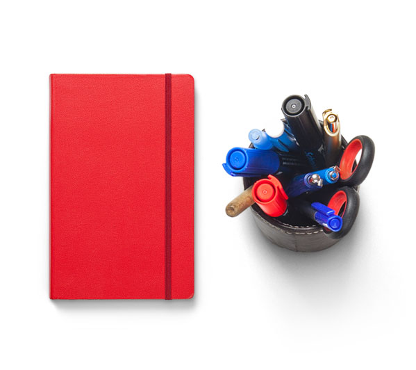

<!-- Slider Start -->
<section id="slider">
  

    

      

        

          <h1 class="animated fadeInUp"> The Joy of Professional Learning</h1>
          
Professional learning is inspirational and engaging. That’s why we designed different recipes clearly outlining the time, tools and ingredients to inspire you to cook up delicious learning activities for teachers.

          
<a href="/books">Download now</a>

        

      

    

  

</section>
<!-- Wrapper Start -->
<section id="intro">
  

    

      

        

          

            <h2>About Us</h2>
            
MKG only hires experts.

          

          
Experts are quantified by having 8+ years of experience in a specific service. Collectively MKG has 50+ years of experience. Your account will never be handled by anyone below a senior role. It’s not fair to the assistants in the industry who are handed more responsibility then they’re ready for or fair to you, the client.

        

      
<!-- .col-md-7 close -->
      

        

          
        

      
<!-- .col-md-5 close -->
    

  

</section>

<section id="feature">
  

    

      

        <h2>We won’t waste your time (or ours)</h2>
        
We are a SCRUM based organization. We even have a certified SCRUM master! 

        
Scrum or Agile, is a disciplined project management process that encourages frequent inspection and adaptation, and strong leadership.

        
We weekly sprint plan, and daily stand-up to know what everyone is working on and uncover any impediments, then we get out of each other’s way and get work done.

        <a href="/mkg-difference" class="btn btn-view-works">See What Makes Us Different</a>
      

    

  

</section>

<!-- Service Start -->
<section id="service">
  

    

      

        <h2>Our Services</h2>
        
We are not a full service agency. We specialize in Search Engine Marketing (Organic and Paid Search), Facebook Advertising, and Analytics.

      

    

    

      

        

          <i class="icon ion-coffee"></i>
          <h4>Organic Search</h4>
          
We have a secret sauce in helping your website rank for your audience. 

        

      

      

        

          <i class="ion-compass"></i>
          <h4>Paid Search</h4>
          
We're hyper focused around your company goals. We’ve run PPC campaigns across five different continents, in more than a dozen languages and across all search engines.

        

      

      

        

          <i class="ion-image"></i>
          <h4>Facebook Advertising</h4>
          
Unlike the tried and true paid search, these channels are constantly changing. We stay informed and test and learn any and all new opportunities.

        

      

      

        

          <i class="ion-bug"></i>
          <h4>Research and Analytics</h4>
          
Lorem ipsum dolor sit amet, consectetur adipisicing elit, sed do eiusmod tempor incididunt ut 

        

      

    

  

</section>
<!-- Call to action Start -->
<section id="call-to-action">
  

    

      

        

          <h2>Overly qualified and certified</h2>
          
In 2016, Google honored our Paid Search team’s hard work by inviting us to be a Premiere Partner - only 5% of agencies using Adwords were invited. This means we have 24/7 Google Adwords support. 

          <a class="btn btn-default btn-call-to-action" href="/about/">See all certifications</a>
        

      

    

  

</section>
<!-- Content Start -->
<section id="testimonial">
  

    

      

        <h2>Fun Facts About Us</h2>
        
From performance of our campaigns to the success of our agency.

      

    

    

      

        

          <ul class="counter-box clearfix">
            <li>
              

                <i class="ion-ios-glasses-outline"></i>
                <h4 class="counter">160000000</h4>
                Impressions
              

            </li>
            <li>
              

                <i class="ion-ios-chatboxes-outline"></i>
                <h4 class="counter">31300</h4>
                Paid Search Conversions
              

            </li>
            <li>
              

                <i class="ion-ios-compose-outline"></i>
                <h4>80%</h4>
                Employee Retention
              

            </li>
            <li>
              

                <i class="ion-ios-timer-outline"></i>
                <h4 class="counter">50</h4>
                Years of collective experience
              

            </li>
          </ul>
        

      

      

        

          

            

                
                
"If you’re looking for a transparent, honest, and smart SEM partner, MKG is fantastic."

                

                  
                  
Dave Arensberg VP of Media

                

            

            

              
                
"If you're interested in MKG for SEO, you will definitely not go wrong. I actually just approved two more SEO-related pieces of work to drive more OnDemand sign ups. MKG is also excellent at demand gen/acquisition. I relied 100% on MKG for this."

                

                  
                  
Marguerite Yeo Director of Web Marketing

                

            

            

              
                
"The MKG team is fantastic and delivers excellent service. The team is proactive, responsive, professional and, most importantly, enthusiastic. The education industry can be complex and MKG has been navigating it with open arms. In addition to a deep knowledge of digital, what resonated for us was how devoted the team is to our business, goals and the overall success of our schools.  We’ve been working with MKG for 3 months now and can already attest that they are a great strategic partner."

                

                  
                  
Kim Carey Associate Director of Branding and Media

                

            

          

        

      

    

  

</section>
