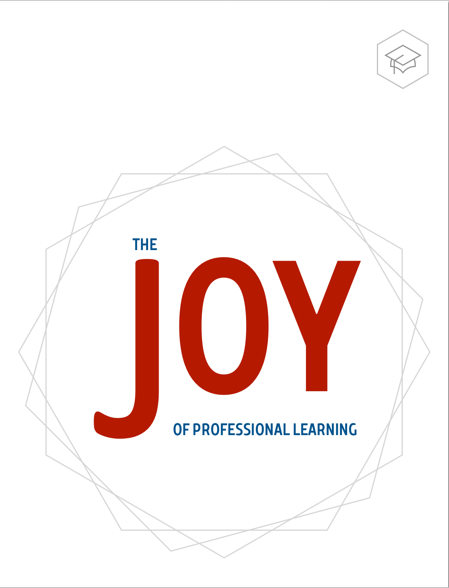

<!-- Slider Start -->
<section id="slider">
  

    

      

        

          <h1 class="animated fadeInUp"> The Joy of Professional Learning</h1>
          
Professional learning is inspirational and engaging. That’s why we designed different recipes clearly outlining the time, tools, and ingredients to inspire you to cook up delicious learning activities for teachers and leaders.

          
<a href="https://itunes.apple.com/us/author/christine-klynen/id1155095017?mt=11">Download now</a>

        

      

    

  

</section>
<!-- Wrapper Start -->
<section id="intro">
  

    

      

        

          

            <h2>For educators, by educators</h2>
            
We have all been professional learning coaches.

          

          
The Joy of Professional Learning introduces recipes for learning, a different approach to current professional development. The recipes represent what a global community of educators has learned over more than a hundred years of combined experience in education.

          
When you create your school’s professional learning events, you integrate professionalism, sustainability, relevance, interactivity, and classroom examples that support a personal learning experience for every teacher and leader.

          
We also know that it takes great educators like you to make this happen. It takes vision and a tribe. It takes planning - what to do tomorrow and what to do throughout the year to keep ongoing professional learning a vibrant part of the school culture.

        

        
<a href="/about/">Meet Our Team</a>

      
<!-- .col-md-7 close -->
      

        

          
        

      
<!-- .col-md-5 close -->
    

  

</section>

<section id="feature">
  

    

      

        <h2>Platform of choice</h2>
        
The Joy of Professional Learning books are available in 51 online stores worldwide. iOS, Kindle, or Chrome. 

      

    

  

</section>

<!-- Service Start -->
<section id="service">
  

    

      

        <h2>Books Available</h2>
        
Below are our top four best sellers. For a full list, <a href="https://itunes.apple.com/us/author/christine-klynen/id1155095017?mt=11">click here</a>

      

    

    

      

        

          
          <h4>The Basics - Part One</h4>
          
This book introduces nine basic recipes that are a different approach to current professional learning.

          <a class="btn btn-view-works" href="https://itunes.apple.com/us/book/the-joy-of-professional-learning-the-basics-part-one/id1164710031?mt=11">Download on iTunes</a>
        

      

      

        

          
          <h4>The Basics - Part Two</h4>
          
This book introduces nine more basic recipes that are a different approach to current professional learning.

          <a class="btn btn-view-works" href="https://itunes.apple.com/us/book/the-joy-of-professional-learning-the-basics-part-two/id1175094462?mt=11">Download on iTunes</a>
        

      

      

        

          
          <h4>Innovative Professional Learning</h4>
          
This book introduces sixteen recipes that are a different and innovative approach to current professional learning. 

          <a class="btn btn-view-works" href="https://itunes.apple.com/us/book/the-joy-of-professional-learning/id1155093835?mt=11">Download on iTunes</a>
        

      

      

        

          
          <h4>The Guest Chefs</h4>
          
For this fourth book in our series of professional learning, we have asked "Guest Chefs" from around the world to add their favorite professional learning recipes. 

          <a class="btn btn-view-works" href="https://itunes.apple.com/us/book/the-joy-of-professional-learning-the-guest-chefs/id1215839734?mt=11">Download on iTunes</a>
        

      

    

  

</section>
<!-- Call to action Start -->
<section id="call-to-action">
  

    

      

        

          <h2>Resouces Available</h2>
          
Some recipes are better with our recommended books, games, and products.

          
Coming soon!

        

      

    

  

</section>
<!-- Content Start -->
<section id="testimonial">
  

    

      

        <h2>Fun Facts About Us</h2>
        
From performance of our campaigns to the success of our agency.

      

    

    

      

        

          <ul class="counter-box clearfix">
            <li>
              

                <i class="ion-ios-glasses-outline"></i>
                <h4 class="counter">1800</h4>
                Downloads
              

            </li>
            <li>
              

                <i class="ion-ios-chatboxes-outline"></i>
                <h4 class="counter">51</h4>
                Available stores worldwide
              

            </li>
            <li>
              

                <i class="ion-ios-compose-outline"></i>
                <h4>2016</h4>
                Featured by Apple as Best Books
              

            </li>
            <li>
              

                <i class="ion-ios-timer-outline"></i>
                <h4 class="counter">100</h4>
                Years of collective experience
              

            </li>
          </ul>
        

      

      

        

          

            

                
                
"I've downloaded and shared these books with my teachers. It's great. I like the format and the layout of the pages and interactives. Also.... great content! It will be very helpful for me as I prepare for working with my institution on reimaging PD."

                

                  
                  
Ryan Orilio  Technology Coordinator at Mohawk Regional Information Center

                

            

            

              
                
"Working in teacher training and further education it is often difficult to get books that are relevant to my teaching environment but these books easily adapt and I look forward to seeing new releases by the Joy of Professional Learning team."

                

                  
                  
Miriam Walsh Cork Education and Training Board

                

            

          

        

      

    

  

</section>
